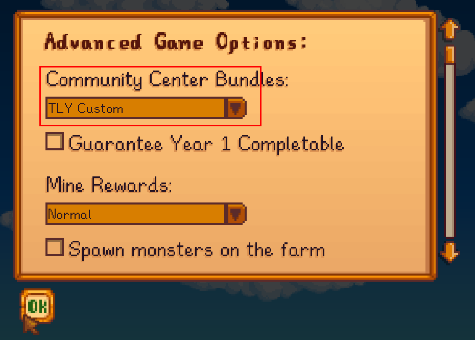
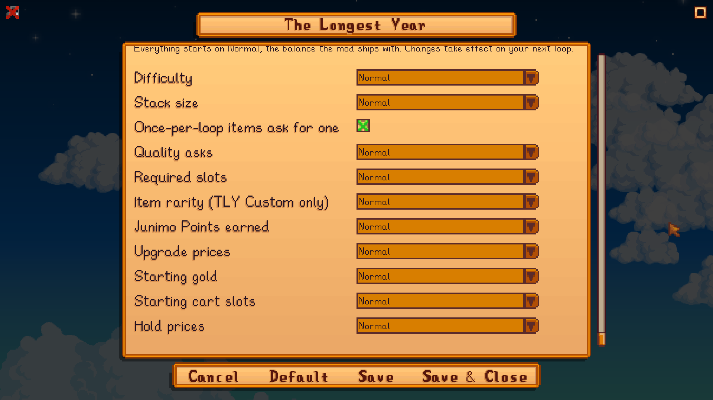
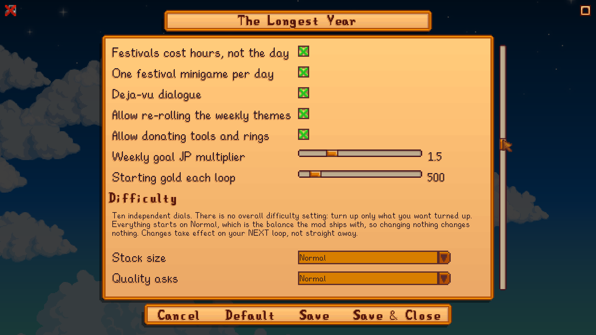

# The Longest Year

**Restore the Community Center within a single year — or the Junimos rewind the seasons and you begin again, a little stronger.**

A roguelite time-loop for Stardew Valley (PC).

⬇ **[Download on Nexus Mods](https://www.nexusmods.com/stardewvalley/mods/47192)**

**The Longest Year** turns Stardew Valley's first year into a roguelite loop. Each season asks you to give back enough of the land's bounty to the old Community Center hall. Fall short by a season's end and the Junimos turn time back to Spring 1 — the world resets, but the strength you've earned (and the power your offerings bank) can carry forward. Restore the whole Center inside one year to break the loop for good.

This is a **beta** (`0.16.17`). It is feature-complete for v1 and stable in testing; what it most needs now is feedback on **difficulty, pricing, and pacing**. See [Giving feedback](#giving-feedback).

**This is the last big engine update.** From here the plan is bug fixes and balance passes driven by your feedback, and then work begins on the story. So this is the version to tell me what is wrong with.

---

## What's New in 0.16.17

**The town half-remembers you, and the books you read can stay read.**

- **Keep your power books.** Nineteen new keeps at the Junimo Shrine, one per power book (Way of the Wind, Friendship 101, The Diamond Hunter and the rest). A row appears on a Fail night once you have read that book this loop; buy it and the book's power survives every rewind. 150 to 750 JP depending on how much the power is worth over a year. Nothing stacks and nothing is free: books you did not buy are still wiped.
- **Deja-vu dialogue.** Villagers you have spent a lot of time with across loops (talks, gifts and heart events add up quietly; hearts themselves still reset) occasionally open with an uncanny line in their own voice. About one a week at most, never in your first loop, never on a villager's first-meeting day, and it never explains itself. Toggle "Deja-vu dialogue" in Features. Idea by u/Gribbleby.
- **Villagers introduce themselves again after a rewind.** From loop 2 on, every villager greeted you with an ordinary line instead of their first-meeting one; the rewind now restores the game's six-day introduction window.
- 0.16.8 to 0.16.16 were internal builds; this is the first release since 0.16.7.

Coming from 0.15.0 or earlier? 0.16.0 added ten independent **Difficulty** dials in the settings menu and made every bundle apply pressure at the season checkpoints, which makes the year harder at every difficulty. Details in [CHANGELOG.md](CHANGELOG.md).

---

## Features

- **Seasonal time-loop.** Each season has a donation minimum. Miss it and the year unwinds to Spring 1.
- **Junimo Points.** Donations earn JP — scaled by rarity and by how late in the year you give. JP banks across loops.
- **The Junimo Shrine.** Spend JP on upgrades that let you hold on to some of what you gained: skill levels, tool tiers, recipes, buildings, a kept pet, the power books you have read, your wallet items and Stardrops, and more.
- **Weekly themes.** Each week, pick a theme that grants a bonus and a paired liability. Plan around it.
- **Carryover surfaces.** A **Bundle Log** book that tracks each season's goals, a Cookbook and Craftbook to bank recipes, and a Junimo Stash chest that survives resets.
- **A real intro.** Lewis greets you on the porch; a Junimo explains the loop. Then the run begins.
- **A starved Traveling Cart.** Joja has squeezed the merchant's suppliers — the cart carries **one item** per visit until you unlock more stalls with the **Cart Stall** upgrades (and Cart Whisperer previews what's coming). Prefer the full vanilla cart? Turn off `LimitTravelingCartStock`.
- **The town half-remembers.** Villagers you have spent a lot of time with across loops occasionally say something uncanny. Rare, no gameplay effect, and it never explains itself. Toggle in Features.
- **Break the loop.** Finish the Center in a year to win — then keep playing or start fresh.

## Requirements

- **Stardew Valley 1.6+** (PC — Windows/Linux/macOS)
- **SMAPI 4.0.0** or newer
- A **new save** on the **Standard farm** (see [Limitations](#limitations-beta))

## Install

1. Install [SMAPI](https://smapi.io/) (4.0.0+).
2. Download the latest `TheLongestYear` release and unzip it into your `Stardew Valley/Mods` folder, so you have `Mods/TheLongestYear/TheLongestYear.dll`.
3. Launch the game through SMAPI.
4. **Start a new game on the Standard farm.** The farm-type and skip-intro options are managed for you — the mod's own intro plays in their place.
5. **Community Center Bundles** under **New → Advanced Options** defaults to **TLY Custom**: every loop rolls a fresh board from the vanilla + remix pools plus the mod's own authored bundles. Prefer the game's own board (or another bundle mod's)? Pick **Normal** or **Remixed** there instead — the mod keeps that board and re-rolls it the same way on every reset. (You can change this later: `Bundle source` in GMCM switches an existing save between all three, applying at its next loop.)

   

## How it works

- **The intro.** On a fresh game, Lewis greets you on the porch, then a Junimo explains the loop. You wake on Spring 1 and pick your first **weekly theme**.
- **Weekly themes.** Each week you choose a theme that grants a bonus and a matching liability (e.g. more forage on pickup, but the mines are closed). The planning hub opens at the start of each week.
- **Seasonal goals.** The **Bundle Log** book (click to open) tracks each season's required donations. Each season has a minimum you must donate to the Center before the season turns. **Miss it and the year unwinds to Spring 1.**
- **Fail night.** When a season's minimum is missed, the Junimos rewind the year. Before the shrine they ask whether to keep the same bundle board for the next loop or let time reshuffle it. The first hold is free; each further hold in a row costs 50, 100, 200, then 300 JP, and reshuffling resets the price. (TLY Custom boards only.) After five fails at the same season, the Junimos also offer to ease that season's gate for a JP price on the same curve.
- **Junimo Points (JP).** Donations earn JP, scaled by rarity and by how late in the year you give (later seasons are worth much more). JP banks across loops.
- **The Junimo Shrine.** On every loop reset (and on a win), spend banked JP on upgrades that let you *hold on to some of what you gained* next loop — skill levels, tool tiers, recipes, buildings, a kept pet, the power books you have read, your wallet items and Stardrops, and more.
- **Carryover surfaces on the farm.** A **Cookbook** (kitchen) and **Craftbook** (table) let you bank recipes to keep; a **Junimo Stash** chest preserves a few items across resets.
- **Winning.** Restore the entire Community Center within a year to break the loop. You can then choose to keep playing that run or start a fresh loop.

## Is this a bug?

A few things get reported often enough to be worth answering up front.

**Demetrius never shows up about the cave, I just get a popup asking mushrooms or bats.**

That is the mod, working as intended. His scene plays once per playthrough; from the second loop on, walking into the farm cave gives you the choice directly instead of replaying a cutscene you have already watched. The mushrooms-or-bats decision is re-offered every loop because the rewind clears it.

**The Traveling Cart only has one item.**

Also intended. Joja is squeezing the merchant's suppliers, and the Cart Stall upgrades at the Junimo Shrine add slots back. If you would rather have the full cart, turn off LimitTravelingCartStock in the config.

**I did the Egg Hunt and now Lewis will not let me do it again today.**

Since 0.14.1, a festival's main event runs once per day. Festivals in this mod do not end your day, so you can walk out and back in - which used to restart the whole festival and let the hunt be repeated for the prize. The stalls, the shop and everyone at the festival still work on a repeat visit. A new loop is a clean slate: as far as the valley is concerned the festival has not happened yet, so you get to do it again.

**A bundle is asking for silver or gold on something that cannot have a quality.**

That was a bug and it is fixed. Quality is only ever asked for on things the game itself gives quality to (crop harvests, rod-caught fish, spawned forage). Existing boards pick the change up at the next reset.

**A weekly goal ticked off without me donating anything.**

Fixed in 0.14.0. Finishing a bundle that only needs some of its listed items used to mark the rest as filled, which credited goals you never handed in. A goal now waits for the real donation.

Anything not on this list, please do report - the bugs tab on Nexus is read.

## Difficulty

Ten independent difficulty dials live in the mod's settings menu (GMCM) under **Difficulty**. There is no overall difficulty setting: turn up only what you want turned up. Every dial has four steps, **Easy / Normal / Hard / Extreme**, and every one starts on **Normal**, which is the balance the mod ships with. Changing nothing changes nothing.

**Changes take effect on your next loop, not straight away.** The dials are stamped onto your save when a loop begins, so the year you are already playing keeps the rules it started under.



**What the bundles ask for**

- **Stack size.** How many of an item a slot asks for, up to 99. Money bundles are never affected.
- **Quality asks.** How often a slot wants a silver or gold star. Items the game never gives a star to are still never asked for at quality, at any step.
- **Required slots.** How many of a bundle's shown items you must actually donate. Hard asks for one more, Easy one fewer, Extreme asks for all of them.
- **Item rarity.** Weights bundles toward harder items: rarer, later in the year, or needing a keg or a press. **TLY Custom bundles only** (see below).

**What you carry between loops**

- **Junimo Points earned.** Scales every JP award, so progress across loops is faster or slower. The season ramp keeps its shape, so late-season donating is still worth the most.
- **Shrine prices.** Scales what upgrades cost at the Junimo Shrine.
- **Starting gold.** Scales the `StartingMoney` value rather than replacing it. Extreme starts you with nothing.
- **Starting cart slots.** How many items the Traveling Cart offers before you buy any Cart Stall upgrade. On Hard and Extreme the cart is empty until you buy Cart Stall I.
- **Hold and pity prices.** Scales the JP price of keeping your board on a Fail night, and of accepting the Junimos' offer to ease a season. The first of each stays free at every step.
- **Season pity.** How readily the Junimos ease a season you keep failing. Easy helps sooner and more, Hard waits longer and helps less, Extreme never helps. Your failed-season counting keeps running either way, so turning it back up picks up where it left off.

**One dial does not work on vanilla boards.** Item rarity applies to **TLY Custom** bundles only, because changing which item a vanilla bundle asks for would be changing the bundle. Stack size, quality asks and required slots all work on vanilla Standard and Remixed boards too.

`tly_difficulty` in the SMAPI console prints what your save is actually running under, including anything you have changed since your last loop. Please attach it to any balance report.

## Switching bundle source later

You are not locked into the board you picked when you started. **Bundle source** in the mod's settings menu (GMCM) is one setting with three choices, and you can move an existing save between any of them:

- **TLY Custom** — the mod composes a fresh board every loop from the vanilla and remix pools plus its own authored bundles.
- **Normal** — the game's own standard bundle layout, re-rolled the same way each loop.
- **Remixed** — the game's own remixed layout, likewise.

Another bundle mod's board is covered by Normal or Remixed: whatever the game generates is what the mod keeps.

Like the difficulty dials, a switch applies at your **next loop**, not straight away. The year you are already playing keeps the board it started with.

**Keeping your board on a Fail night works on all three.** If you hold, you get the same board back next loop whichever source it came from.

## Configuration

The **Features** section of the settings menu turns individual parts of the mod off or tunes them, and changes there apply straight away:



All knobs live in `Mods/TheLongestYear/config.json` (created on first run). The values most worth tuning during the beta:

| Setting | Default | What it controls |
|---|---|---|
| `Jp.CommonJp` / `UncommonJp` / `RareJp` / `VeryRareJp` | 1 / 3 / 10 / 25 | JP awarded per donated item by rarity |
| `Jp.SeasonMultipliers` | `[1.0, 1.5, 2.5, 4.0]` | Per-season JP multiplier (Spring→Winter) |
| `Jp.BundleCompletionBonus` / `RoomCompletionBonus` / `WeeklyQuestCompletionBonus` | 15 / 60 / 30 | Bonus JP for milestones (×season multiplier) |
| `StartingMoney` | 500 | Gold at the start of each loop |
| `BundleQuotas` | per-bundle | How much each percentage-bundle asks for |
| `StashTileX/Y` | `0,0` (auto) | Where the Junimo Stash chest is placed (`0,0` = auto-pick near the farmhouse). The Bundle Log / Cookbook / Craftbook are placeable furniture you can put anywhere. |
| `LimitTravelingCartStock` | `true` | Cap the Traveling Cart to the stalls unlocked by the Cart Stall upgrades (one item until Cart Stall II). `false` = full vanilla cart |
| `BundleSource` | `Engine` | One setting, three values: `Engine` (the mod's own board every loop, the new-game **TLY Custom** choice), `Normal` or `Remixed` (the game's own board of that kind, or another bundle mod's, re-rolled the same way each loop). Switchable on an existing save; takes effect at the next loop. See [Switching bundle source later](#switching-bundle-source-later) |
| `BundleHoldCosts` | `[0, 50, 100, 200, 300]` | JP cost of keeping the same bundle board on a Fail night, by how many holds you have taken in a row (first is free; the last value repeats). Reshuffling resets the count |
| `PityThreshold` / `PityQuotaStep` / `PityQuotaFloor` / `PityTrimPerStep` / `PityCosts` | 5 / 0.10 / 0.50 / 2 / `[0, 50, 100, 200, 300]` | Season pity: fails at one season before the Junimos offer help; quota cut per extra fail on a kept board and its floor; hardest items trimmed per extra fail on a reshuffle; JP price of accepting, by consecutive accepts. `PityEnabled` turns the offer off (fails are still counted) |
| `Enabled` | `true` | Master switch — turn the whole mod off to play vanilla |

Upgrade prices are defined in the shrine catalog (e.g. Cookbook/Craftbook tiers at 150 / 350 / 700 JP). Feedback on these is welcome.

## Limitations (beta)

- **PC only.** No Android port yet.
- **Standard farm only.** Other farm layouts put buildings in water and the stash off-map; the mod forces Standard on new games.
- **Start on a new save.** A run can only begin from a new game; other saves load normally and are left untouched.
- Intro cutscene and dialogue are a first pass.
- Multiplayer is untested.

## Giving feedback

What helps most right now:

1. **Difficulty** — do the seasonal minimums feel fair? Too punishing, too easy? Which season wall hit hardest?
2. **Pricing** — are JP earnings and shrine upgrade costs well-balanced? What did you save for first, and did it feel worth it?
3. **Pacing** — how many loops before the run "clicked"? Did the carryover make later loops feel meaningfully stronger?
4. **Bugs / crashes** — include your `SMAPI-latest.txt` (`Stardew Valley/ErrorLogs/`).

## Art wanted

The mod leans on vanilla sprites throughout. If anyone would enjoy making some custom **book / sprite artwork** (the Cookbook and Craftbook especially), I'd genuinely love to accept it and credit you. Drop a note in the comments.

*Banner art by **cwybabiesucks** — thank you!*

## Translations

As of this version, every player-visible string in the mod lives in a JSON file
(`i18n/default.json`) — the mod is fully translatable with no DLL edits or rebuilds. See
[`docs/TRANSLATING.md`](docs/TRANSLATING.md) for how to add a language. If you translate it,
let us know (Nexus DM or GitHub issue) and we'll link your work from the mod page.

---

## Also by this author

- [**Android Consolizer**](https://www.nexusmods.com/stardewvalley/mods/41869) — Full console-style controller support for Stardew Valley on Android.
- [**Cart Catalog**](https://www.nexusmods.com/stardewvalley/mods/47146) — Order from the Traveling Cart's daily stock; items arrive in a package on your porch the next morning.
- [**Nap Time**](https://www.nexusmods.com/stardewvalley/mods/42616) — Nap in bed to recover energy without ending the day. Configurable rate and wake-up cap. PC + Android.

## Source

Open source (MIT) — [github.com/sonofskywalker3/TheLongestYear](https://github.com/sonofskywalker3/TheLongestYear)

---

<!-- GitHub-only appendix (not part of the Nexus description) -->

## Building from source

```bash
dotnet build src/TheLongestYear/TheLongestYear.csproj -c Release   # builds + deploys to the Mods folder
dotnet test  TheLongestYear.sln -c Release                          # runs the unit suite
```

Core game logic lives in `TheLongestYear.Core` (pure, unit-tested); SMAPI/Harmony glue lives in `TheLongestYear`. Design specs and implementation plans are under `docs/superpowers/`.

## Credits

By **sonofskywalker3**. Banner art by **cwybabiesucks**. Deja-vu villager dialogue idea by **u/Gribbleby**. Built on [SMAPI](https://smapi.io/) and [HarmonyX](https://github.com/BepInEx/HarmonyX). Stardew Valley is a trademark of ConcernedApe.

## License

Released under the [MIT License](LICENSE).
